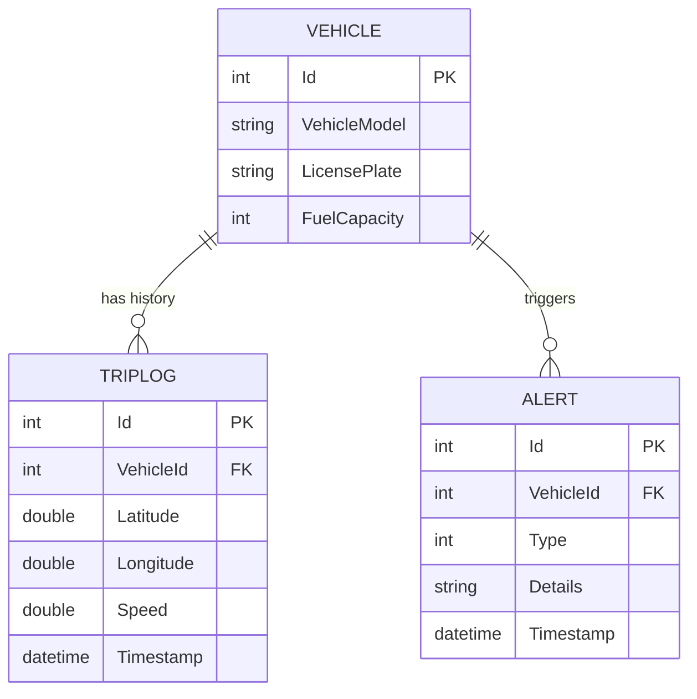

# Fleet Analytics API
 
Backend API built with .NET for real time vehicle telemetry ingestion and analysis. It enforces business rules (speeding limits), and generates actionable alerts while ensuring data integrity.

## Features

* **High Volume Data Ingestion:** Optimized `POST` endpoint to receive telemetry data (Location, Speed, Timestamp).
* **Real Time Intelligence:** Built-in business logic engine that automatically detects speeding violations (> 80 km/h) during the ingestion process.
* **Transactional Integrity:** Implements **Atomic Transactions** using Entity Framework Core. Ensures that a Telemetry Log and a generated Alert are either *both* saved or *neither* is saved, preventing data inconsistency.
* **Relational Mapping:** Efficient retrieval of complex data using LINQ sub-queries to join Vehicles, Logs, and Alerts without overhead.
* **RESTful Architecture:** Clean separation of concerns with dedicated Controllers and Services.

## Tech Stack

* **Framework:** .NET 9 (C#)
* **Database:** SQLite (for development) / Entity Framework Core (ORM)
* **Architecture:** Layered Architecture (Models, DTOs, Services, Controllers)
* **Validation:** Data Annotations & Business Logic Validation
* **Documentation:** Swagger

## How It Works

### 1. Ingestion & Validation
The system receives a JSON payload via `POST /api/triplogs`. It validates:
* **Foreign Key Integrity:** Checks if the `VehicleId` exists in the database.
* **Data Completeness:** Ensures all required telemetry fields are present.

### 2. Intelligent Processing
Before persisting data, the **Service Layer** analyzes the speed:
* **If Speed > 80 km/h:** An `Alert` object is instantiated with type `UserSpeeding`.
* The Alert is added to the DbContext transaction context.

### 3. Atomic Persistence
The system calls `SaveChangesAsync()` **only once** at the end of the flow. This guarantees that the Telemetry Log and any potential Alert are committed in a single database transaction.

## 🔌 API Endpoints

### Telemetry (TripLogs)

| Method | Endpoint | Description |
| :--- | :--- | :--- |
| `POST` | `/api/triplogs` | Ingests new GPS telemetry data. Triggers alerts if rules are violated. |
| `GET` | `/api/triplogs` | Retrieves full history of all telemetry logs. |
| `GET` | `/api/triplogs/{id}` | Retrieves telemetry history for a specific Vehicle ID. |

### Alerts

| Method | Endpoint | Description |
| :--- | :--- | :--- |
| `GET` | `/api/alerts` | Returns a list of all generated alerts (e.g., Speeding), joined with Vehicle data. |
SwaggerEndpoints.png

## Screenshots

### API Documentation (Swagger)


### Speeding Alert Logic (JSON Response)

## ER Diagram




## How to Run

1.  **Clone the repository:**
    ```bash
    git clone [https://github.com/DeVFirmino/FleetAnalytics.git](https://github.com/SEU-USUARIO/FleetAnalytics.git)
    ```
2.  **Navigate to the project folder:**
    ```bash
    cd FleetAnalytics
    ```
3.  **Apply Database Migrations:**
    ```bash
    dotnet ef database update
    ```
4.  **Run the API:**
    ```bash
    dotnet run
    ```
5.  **Access Swagger:**
    Open `http://localhost:5056/swagger` in your browser.
