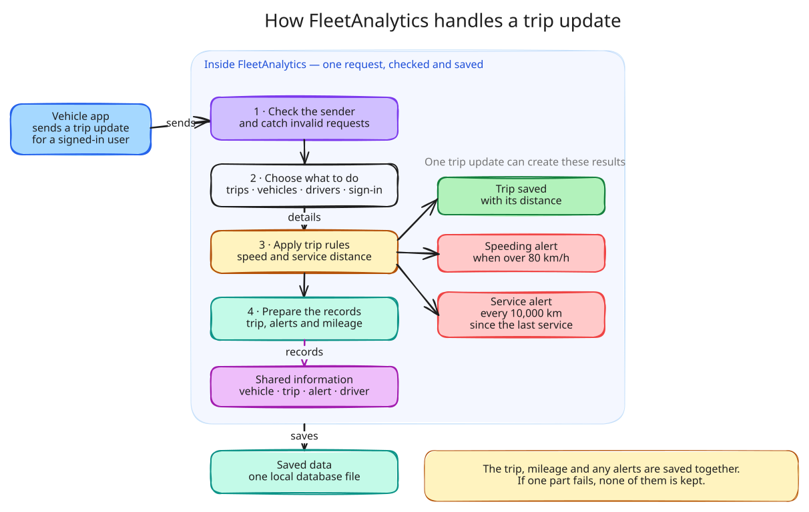

# Fleet Analytics API

A .NET API that receives GPS readings from vehicles, adds the distance driven to each vehicle's odometer and raises an alert when a vehicle goes over the speed limit or is due for a service. A reading, its alerts and the odometer update are saved in one transaction, so a failure halfway through never leaves an alert without the reading that caused it.

.NET 9 · ASP.NET Core · EF Core · SQLite · xUnit

[Run it](#run-it) · [Send two readings](#send-two-readings) · [Tests](#tests)



*Editable source: [`docs/architecture.excalidraw`](docs/architecture.excalidraw). Open it on [excalidraw.com](https://excalidraw.com) and export the SVG again after changes.*

## What happens to a reading

`POST /api/triplogs` receives one reading: vehicle, latitude, longitude, speed and time. [`TripLogService`](src/FleetAnalytics.Application/Services/TripLogService.cs) then:

- returns 404 if the vehicle doesn't exist
- adds a `HighSpeed` alert when the speed is above 80 km/h
- measures the distance from the vehicle's previous reading with the Haversine formula and adds it to the odometer
- adds a `MaintenanceDue` alert once the vehicle has driven more than 10,000 km since it was registered
- saves the reading, the alerts and the odometer with a single `SaveChangesAsync`

The repositories only stage changes. The `DbContext` is registered as the unit of work and commits everything at the end, so if any step throws before that, nothing is written.

## Run it

Install the [.NET 9 SDK](https://dotnet.microsoft.com/download/dotnet/9.0) and the EF Core tool, then create the SQLite database and start the API:

```bash
dotnet tool install --global dotnet-ef
git clone https://github.com/DeVFirmino/FleetAnalytics.git
cd FleetAnalytics/src/FleetAnalytics.Api
dotnet ef database update
dotnet run
```

The database file, `fleet.db`, is created in the folder you run these commands from, so keep both in `src/FleetAnalytics.Api`. Swagger is at <http://localhost:5056/swagger>.

## Send two readings

Every endpoint except login needs a token. Login accepts a fixed `admin` / `admin` pair, which is enough for a local run:

```bash
TOKEN=$(curl -s -X POST http://localhost:5056/api/auth/login \
  -H 'Content-Type: application/json' \
  -d '{"username":"admin","password":"admin"}' | jq -r .token)
```

Register a vehicle, then send two readings about 10 km apart, the second one at 95 km/h:

```bash
curl -X POST http://localhost:5056/api/vehicles \
  -H "Authorization: Bearer $TOKEN" -H 'Content-Type: application/json' \
  -d '{"licensePlate":"ABC-1234","vehicleModel":"Volvo FH","fuelCapacity":400,"odometer":9995}'

curl -X POST http://localhost:5056/api/triplogs \
  -H "Authorization: Bearer $TOKEN" -H 'Content-Type: application/json' \
  -d '{"vehicleId":1,"latitude":35.8989,"longitude":14.5146,"speed":50,"timestamp":"2026-09-26T09:00:00Z"}'

curl -X POST http://localhost:5056/api/triplogs \
  -H "Authorization: Bearer $TOKEN" -H 'Content-Type: application/json' \
  -d '{"vehicleId":1,"latitude":35.8858,"longitude":14.4031,"speed":95,"timestamp":"2026-09-26T09:12:00Z"}'
```

`GET /api/triplogs/alerts` now returns the speeding alert:

```json
[
  {
    "id": 1,
    "vehicleModel": "Volvo FH",
    "speed": 95,
    "type": "HighSpeed",
    "timestamp": "2026-09-26T09:12:00"
  }
]
```

`GET /api/vehicles/1` shows the odometer at about 10,005.15 km. It went past 10,000 without a maintenance alert because the count starts from the odometer the vehicle was registered with, 9,995 here, not from zero.

## Endpoints

| Method | Route | What it does |
| :--- | :--- | :--- |
| `POST` | `/api/auth/login` | Returns a JWT for `admin` / `admin` |
| `POST`, `GET` | `/api/vehicles` | Registers a vehicle, lists vehicles |
| `GET`, `PUT`, `DELETE` | `/api/vehicles/{id}` | Reads, updates or deletes one vehicle |
| `POST`, `GET` | `/api/drivers` | Registers a driver, lists drivers |
| `GET`, `PUT`, `DELETE` | `/api/drivers/{id}` | Reads, updates or deletes one driver |
| `POST` | `/api/triplogs` | Records one reading and any alerts it raises |
| `GET` | `/api/triplogs` | All readings, with the vehicle model |
| `GET` | `/api/triplogs/{id}` | Readings for the vehicle with that id |
| `GET` | `/api/triplogs/alerts` | All alerts, with the vehicle model |

An unknown vehicle or driver id returns 404 with a `ProblemDetails` body. The one exception is `GET /api/triplogs/{id}`, which returns an empty list.

## Tests

Run them from the repository root. From `src/FleetAnalytics.Api` the command finishes without running any test:

```bash
cd ../..
dotnet test
```

The 14 tests are mostly unit tests of the services with Moq. [`TripLogIngestionAtomicityTests`](tests/FleetAnalytics.Tests/Services/TripLogIngestionAtomicityTests.cs) runs ingestion against an in-memory SQLite database instead. One test checks that the reading and its speeding alert are saved together. The other makes the trip log step throw after the alert was staged and checks that neither row was written.

## Scope

- Login is a hard-coded `admin` / `admin`, and the JWT signing key falls back to a value in the code when `Jwt:Key` isn't configured.
- Nothing records a service, so once a vehicle has driven 10,000 km since registration, every new reading adds another `MaintenanceDue` alert.
- Drivers are stored but not linked to vehicles or readings.
- `AlertType` also has `LowFuel` and `Geofence`, but nothing raises them.
